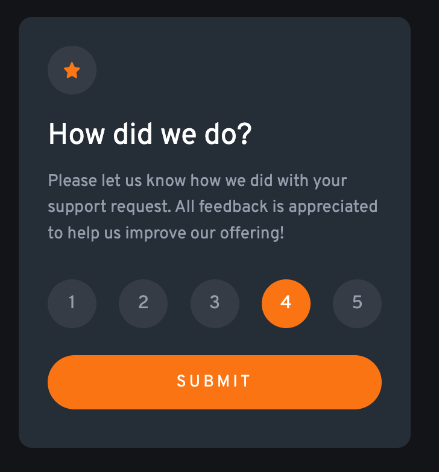

# Frontend Mentor - Interactive rating component solution

This is a solution to the [Interactive rating component challenge on Frontend Mentor](https://www.frontendmentor.io/challenges/interactive-rating-component-koxpeBUmI). Frontend Mentor challenges help you improve your coding skills by building realistic projects. 

## Table of contents

- [Overview](#overview)
  - [The challenge](#the-challenge)
  - [Screenshot](#screenshot)
  - [Links](#links)
- [My process](#my-process)
  - [Built with](#built-with)
  - [What I learned](#what-i-learned)
  - [Continued development](#continued-development)
  - [Useful resources](#useful-resources)
- [Author](#author)
<!-- - [Acknowledgments](#acknowledgments) -->

## Overview

### The challenge

Users should be able to:

- View the optimal layout for the app depending on their device's screen size
- See hover states for all interactive elements on the page
- Select and submit a number rating
- See the "Thank you" card state after submitting a rating

### Screenshot



### Links

- Solution URL: [github.com/johnmal-dev/interactive-rating-component](https://github.com/johnmal-dev/interactive-rating-component)
- Live Site URL: [johnmal-interactive-rating-component.netlify.app](https://johnmal-interactive-rating-component.netlify.app/)

## My process

### Built with

- Semantic HTML5 markup
- CSS custom properties
- Flexbox
- Mobile-first workflow
- PureRef Images App

### What I learned
- Swap between two cards by using a 'hidden' class
```html
<body>
  <div class="card">
    <div class="card-content-1">
      ...
    </div>
    <div class="card-content-2 hidden">
      ...
    </div>
  </div>
</body>
```
- Use CSS custom properties (variables)
```css
:root {
  --orange: hsl(25, 97%, 53%);
  --white: hsl(0, 0%, 100%);
  --light-grey: hsl(217, 12%, 63%);
  ...
}
```
- How to target a parent element's class list
```js
if (e.target.classList.contains('rating-btn')) {
  e.target.classList.add('active')
} else {
  e.target.parentElement.classList.add('active');
}
```

### Continued development

An example video used SCSS CSS preprocessor. Without a CSS preprocessor, my code was less organized. For my next project, I will use the Less CSS extension.

### Useful resources

- [PureRef](https://www.pureref.com/) - This helped me compare my work to the provided example images. I really liked this app and will use it going forward.
- [MRZ.Code.Manufacture](https://www.youtube.com/channel/UC8vDv2c3-wQfTnOr84CwH4Q/) - This is an amazing youtube channel which guided me with a typical workflow . I'd recommend it to anyone still learning this concept.

## Author

- Website - [John Malapit](https://www.johnmal.dev)
- Frontend Mentor - [@johnmal-dev](https://www.frontendmentor.io/profile/johnmal-dev)
- Twitter - [@johnmal_dev](https://www.twitter.com/johnmal_dev)

<!-- ## Acknowledgments -->